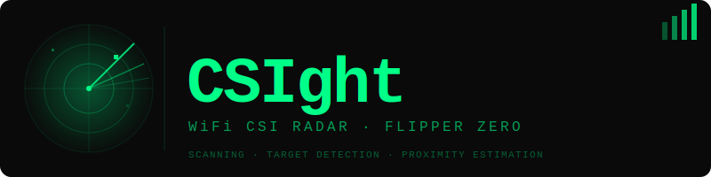

<div align="center">



<br/>

**See through walls. No cameras. No IR. Just WiFi.**

[](LICENSE)
[](https://github.com/joelewis012/CSIght/releases/latest)
[]()
[]()
[]()
[]()

### [⬇ Download Latest Release](https://github.com/joelewis012/CSIght/releases/latest)

</div>

---

## What is CSIght?

Every WiFi packet that moves through a room carries hidden data about that room — the amplitude, phase, and propagation delay of the signal across dozens of frequency subcarriers. When something moves, those values shift. CSIght reads those shifts in real time using your ESP32's WiFi hardware and renders them on your Flipper Zero as a live radar display.

No special hardware. No cameras. No IR sensors. Just the WiFi radio already sitting on your ESP32 expansion board.

---

## Displays

```
┌─────────────────┐  ┌─────────────────┐  ┌─────────────────┐
│    CSIght       │  │CSIght WATERFALL │  │    CSIght       │
│   ·  ·  ·       │  │█░░░░░░░░░░░░█░░│  │   PROXIMITY     │
│  · ╭───╮ ·      │  │█░░░░█░░░░░░░█░░│  │                 │
│  · │ ╱ │ · MOTION│  │█░░░░█░░█░░░░█░░│  │   ○             │
│  · ╰───╯ · ████│  │█░░░░█░░█░░█░█░░│  │  ○○○            │
│  · · ● · ·  RANGE│  │█░██░█░░█░░█░█░█│  │ ○○○○○          │
│  · · · · ·  ████│  │                 │  │    ■            │
│         SENS: 7 │  │            S:7  │  │   72%           │
└─────────────────┘  └─────────────────┘  └─────────────────┘
    Radar Mode           Waterfall Mode      Proximity Mode
```

**Radar** — rotating sweep with fading blips. Motion triggers a `TARGET ACQUIRED` flash.
**Waterfall** — scrolling history of CSI amplitude across all subcarriers.
**Proximity** — concentric arc display showing estimated distance to detected target.

Switch modes with `←` / `→` during scanning.

---

## Features

- **Auto chip detection** — ESP32 reports its own model and CSI support tier on connect
- **40+ board presets** — covers official Flipper boards, DevKits, XIAO, Adafruit, SparkFun, M5Stack, LOLIN, and more
- **Custom pin override** — set any TX/RX pair, saved to SD card so you only do it once
- **Three display modes** — radar sweep, waterfall, proximity — switchable live
- **Adjustable sensitivity** — tune detection threshold on the fly
- **Proximity estimation** — rough distance to detected motion using signal delta strength
- **Zero configuration on known boards** — preset auto-populates pins from firmware handshake

---

## Compatibility

### ESP32 chips

| Chip | CSI Support | Notes |
|------|-------------|-------|
| ESP32-S3 | ✅ Full | Recommended |
| ESP32-C3 | ✅ Full | Great budget option |
| ESP32-C6 | ✅ Full | WiFi 6, best sensitivity |
| ESP32-C61 | ✅ Full | C6 without 802.15.4 |
| ESP32 (original) | ⚠️ Limited | Amplitude only, motion detection still works |
| ESP32-S2 | ❌ None | No WiFi CSI support |
| ESP32-H2 | ❌ None | 802.15.4 only, no WiFi |

> **Full** = amplitude + phase across all subcarriers → better proximity accuracy
> **Limited** = amplitude only → motion detection works, proximity less precise

### Flipper firmware

| Firmware | Status |
|----------|--------|
| Official | ✅ |
| Momentum | ✅ |
| Unleashed | ✅ |

---

## Controls

| Button | Scanning mode | Setup screens |
|--------|--------------|---------------|
| `←` / `→` | Switch display mode | — |
| `↑` | Sensitivity up | Next option |
| `↓` | Sensitivity down | Previous option |
| `OK` | — | Confirm selection |
| `Back` | Exit app | Go back |

---

## Installation

### 1. Download

Grab the latest release ZIP from the [Releases page](https://github.com/joelewis012/CSIght/releases/latest). It contains:

```
CSIght/
├── flipper/
│   ├── official/    csight.fap
│   ├── momentum/    csight.fap
│   └── unleashed/   csight.fap
└── esp32/
    ├── bootloader.bin
    ├── partition-table.bin
    ├── csight_esp32.bin
    └── flash_args
```

### 2. Flash the ESP32

See **[FLASH_INSTRUCTIONS.md](FLASH_INSTRUCTIONS.md)** for the full guide and wiring diagram.

Quick start:

```bash
pip install esptool

esptool.py --chip esp32 --port /dev/ttyUSB0 --baud 460800 \
  write_flash \
  0x1000  bootloader.bin \
  0x8000  partition-table.bin \
  0x10000 csight_esp32.bin
```

### 3. Install the FAP

Copy the `.fap` matching your Flipper firmware to:

```
SD Card/apps/GPIO/csight.fap
```

Launch from **Apps → GPIO → CSIght**.

### 4. Wire it up

| ESP32 pin | Flipper GPIO |
|-----------|-------------|
| TX (default 17) | Pin 14 |
| RX (default 16) | Pin 13 |
| GND | GND |
| 3.3V | 3.3V |

Pins are configurable inside the app — saved to SD, set once.

---

## Building from source

Push to `main` to trigger the GitHub Actions build. It compiles all three Flipper firmware targets and packages everything into a release ZIP. Tag with `v1.0` to publish a GitHub Release automatically.

```bash
# ESP32 firmware (requires ESP-IDF v5.2+)
cd esp32
idf.py build

# Flipper FAP
cd flipper
ufbt
```

---

## Roadmap

| Version | Feature |
|---------|---------|
| v1.x | Breathing detection (experimental) |
| v2.0 | Multi-ESP32 node support for true directional radar |

---

## License

MIT © CSIght contributors — see [LICENSE](LICENSE) for full terms.
